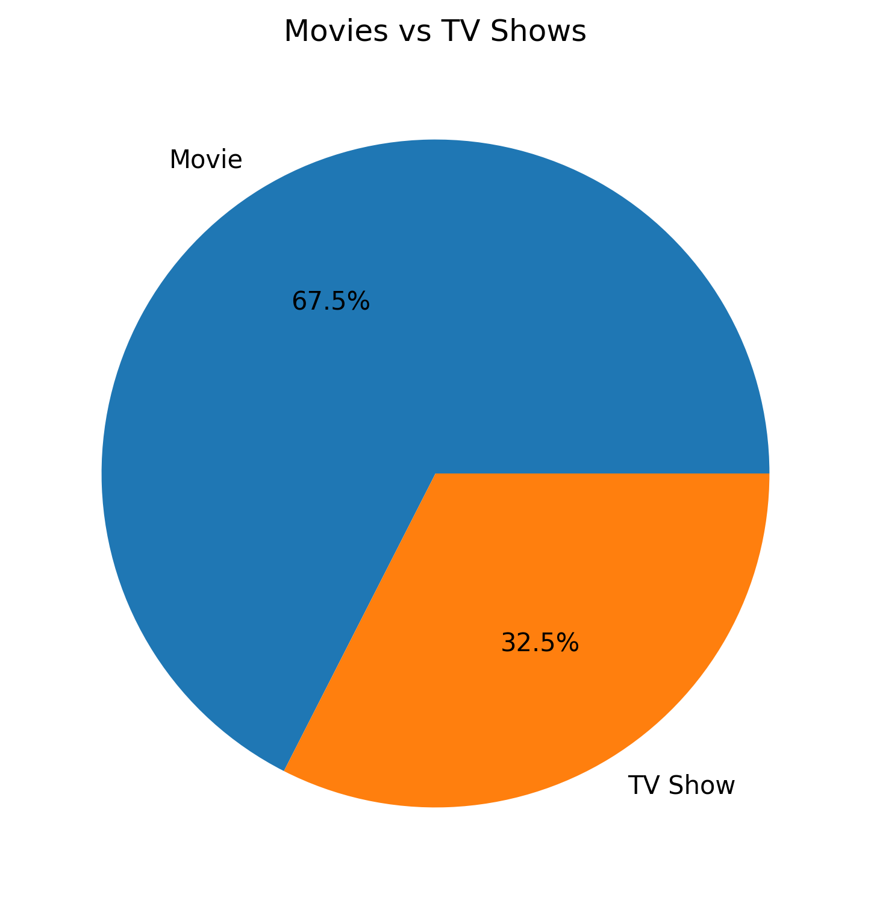
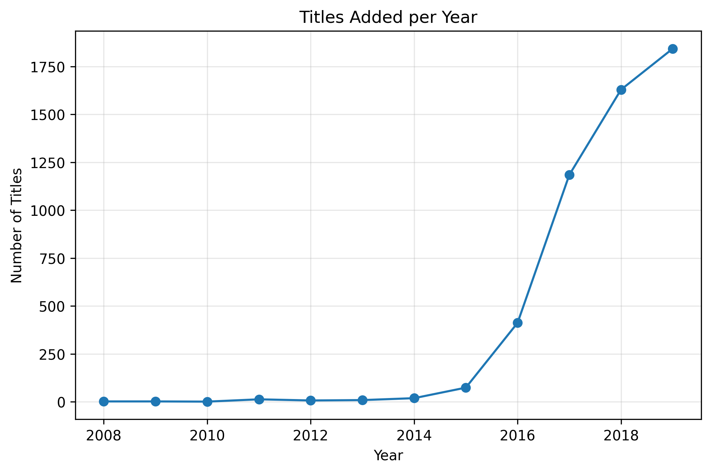
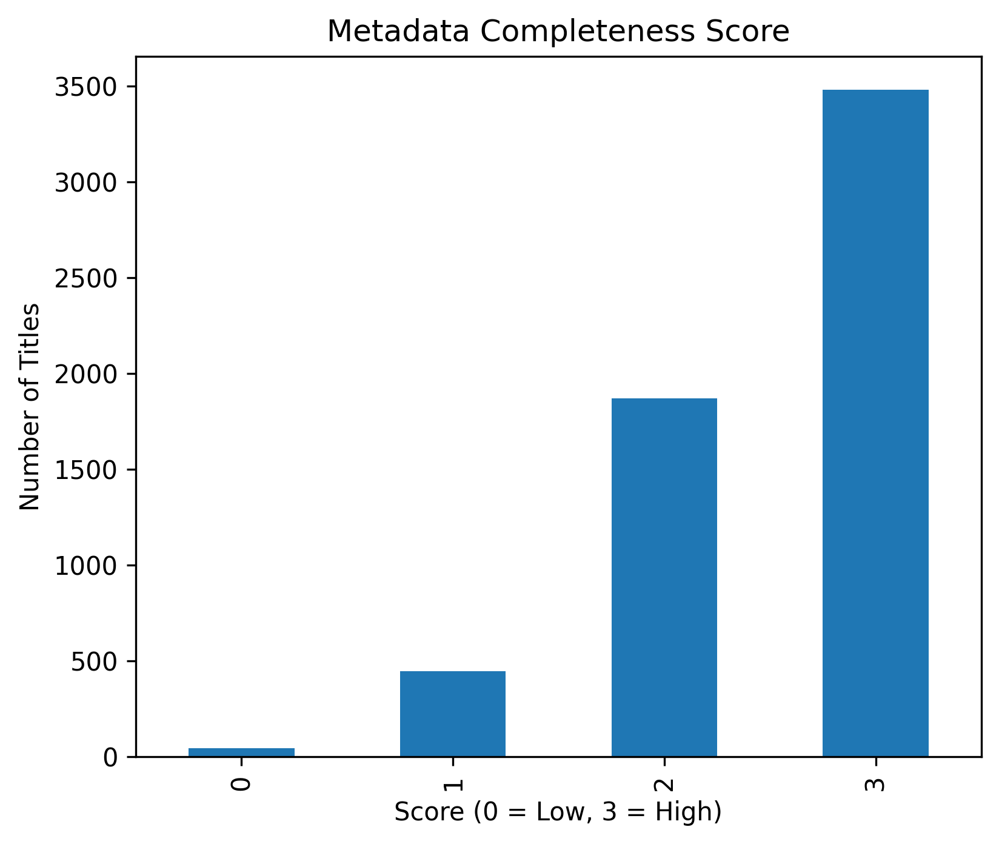

# 🎬 Netflix Content Analysis — Data Analyst Portfolio Project

This project presents an end-to-end data analysis workflow on Netflix’s content library using Python, Jupyter Notebook, and Power BI–ready outputs. The analysis covers data exploration, cleaning, feature engineering, visualization, and strategic insights to demonstrate both technical and business-oriented analytical skills.

---

## 📌 Project Overview

**Objective:**
Analyze Netflix’s content catalog to understand content composition, audience targeting, global expansion patterns, and data readiness for dashboard development.

**Key Questions:**

* What is the composition of Netflix’s library (Movies vs TV Shows)?
* Which audience segments dominate the catalog?
* How has Netflix expanded content over time?
* Which countries and genres lead content production?
* How reliable is the dataset for dashboarding and business reporting?

---

## 🛠️ Tools & Technologies

* **Python 3**
* **Pandas, NumPy** — Data manipulation & feature engineering
* **Matplotlib, Seaborn** — Visualizations
* **Jupyter Notebook** — Analysis workflow
* **Power BI** — Dashboard design (optional / export-ready)

---

## 📂 Project Structure

```
project-folder/
│
├── notebook/
│   └── netflix_analysis.ipynb
│
├── data/
│   ├── raw/
│   │   └── netflix_titles_nov_2019.csv
│   └── processed/
│       └── netflix_cleaned.csv
│
├── visual/
│   ├── 01_movies_vs_tvshows.png
│   ├── 02_top_ratings.png
│   ├── 03_release_year_trend.png
│   ├── 04_top_countries.png
│   ├── 05_top_genres.png
│   ├── 06_content_count.png
│   ├── 07_audience_group.png
│   ├── 08_metadata_completeness.png
│   ├── 09_content_recency.png
│   ├── 10_titles_added_per_year.png
│   ├── 11_movies_vs_tvshows_over_time.png
│   ├── 12_top_countries_over_time.png
│   ├── 13_top_genres_over_time.png
│   ├── 14_movie_duration_histogram.png
│   └── 15_metadata_quality_percentage.png
│
└── README.md
```

---

## 🔄 Workflow Summary

### 1️⃣ Data Exploration

* Inspected dataset structure and schema
* Identified missing values and data types
* Reviewed content type, ratings, release years, and duration patterns

### 2️⃣ Data Cleaning

* Converted date and numeric fields
* Handled missing categorical values using semantic placeholders
* Created a missing date flag for time-based analysis
* Removed duplicates and validated dataset consistency

### 3️⃣ Feature Engineering

Custom features were created to enhance business analysis:

* `audience_group` — Categorizes titles into Adult, Kids, and General
* `content_recency` — Segments titles by release period
* `metadata_completeness` — Scores data quality for dashboard readiness
* `duration_value`, `duration_type` — Standardized duration fields
* `year_added`, `month_added` — Time-based growth tracking

### 4️⃣ Exploratory Data Analysis (EDA)

* Audience segmentation trends
* Genre and country dominance
* Content growth and expansion over time
* Metadata quality assessment

### 5️⃣ Visualizations

Each chart is exported as a standalone image for flexible use in dashboards, reports, and portfolio documentation:

### 📊 Sample Visuals

#### Movies vs TV Shows



#### Top Genres


#### Content Growth Over Time



#### Metadata Quality



---

## 💡 Key Insights

* **Content Strategy:** Movies dominate the catalog, suggesting a scalable content investment approach, while TV shows support long-term user engagement.
* **Audience Targeting:** Adult-oriented content represents the largest segment, indicating a focus on Netflix’s primary revenue-generating demographic.
* **Global Expansion:** While the United States leads content production, international titles form a significant and growing portion of the library.
* **Genre Positioning:** Drama and international storytelling are central to Netflix’s content identity.
* **Data Readiness:** Most titles exhibit high metadata completeness, making the dataset suitable for KPI reporting and dashboarding.

---

## ⚠️ Limitations

* Missing values in `date_added` and `country` may affect the accuracy of time-based and geographic trend analysis.
* The dataset reflects a snapshot from November 2019 and does not capture recent changes in Netflix’s content strategy or catalog expansion.

---

## 🎯 Business Recommendations

* Increase investment in international drama and regional content to strengthen global market presence.
* Expand family and kids-oriented titles to balance the adult-heavy catalog and broaden audience reach.
* Improve metadata completeness for older titles to enhance content discoverability and recommendation system performance.

---

## 🚀 How to Run

1. Clone this repository

```bash
git clone <your-repo-url>
cd project-folder
```

2. Install dependencies

```bash
pip install pandas numpy matplotlib seaborn
```

3. Run the notebook
   Open `notebook/netflix_analysis.ipynb` using Jupyter Notebook or VS Code and execute all cells in order.

---

## 📄 Dataset Source

Netflix Titles Dataset — November 2019 (Kaggle / Flixable)

---

## ⭐ Acknowledgments

This project was developed as part of a data analytics portfolio to demonstrate practical skills in data cleaning, exploratory analysis, visualization, and business storytelling.
